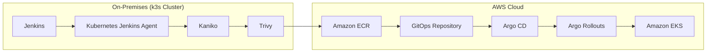
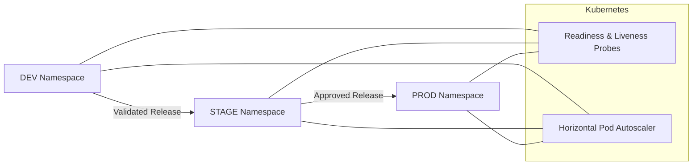

# 🚀 Enterprise Cloud-Native CI/CD Platform

> A production-style cloud-native CI/CD platform demonstrating Infrastructure as Code, Kubernetes, GitOps, Progressive Delivery, and automated deployments on AWS.

<p align="center">


</p>

---

# 📖 Overview

This repository demonstrates a complete enterprise-style CI/CD platform built on a **hybrid Kubernetes architecture**.

The Continuous Integration (CI) platform runs on an **on-premises k3s Kubernetes cluster**, while application workloads are deployed to **Amazon Elastic Kubernetes Service (EKS)**.

The platform automates the complete software delivery lifecycle—from provisioning cloud infrastructure with **Terraform**, through secure container image creation and vulnerability scanning, to GitOps-based deployments using **Argo CD** and progressive delivery with **Argo Rollouts**.

Rather than focusing on the application itself, this project demonstrates modern DevOps practices commonly used in enterprise production environments.

---

# 🏗 Hybrid Architecture

Unlike traditional cloud-only CI/CD platforms, this solution separates the build infrastructure from the runtime environment.

The CI infrastructure executes inside an **on-premises k3s cluster**, while the deployed application runs inside **Amazon EKS**.

This architecture reflects many enterprise environments where internal build systems remain on-premises while production workloads leverage cloud scalability and managed Kubernetes services.



---

# 🌍 Kubernetes Environment Separation

To simulate a production-grade deployment strategy, the application is deployed into three isolated Kubernetes environments.

| Environment | Purpose |
|------------|---------|
| **DEV** | Development and functional validation |
| **STAGE** | Integration testing and release verification |
| **PROD** | Stable production deployment |

Each namespace contains its own:

- Argo Rollout
- Kubernetes Service
- Horizontal Pod Autoscaler (HPA)
- Helm Release
- Readiness Probe
- Liveness Probe

This separation enables safe release promotion while keeping production isolated from development activities.

The application also implements Kubernetes health probes:

- **Readiness Probe** – Ensures the application is ready to receive traffic before it is added to the Service endpoints.
- **Liveness Probe** – Monitors application health and automatically restarts failed containers.



---

# 🔄 CI/CD Pipeline

The following diagram illustrates the complete software delivery lifecycle from source code to production deployment.

```mermaid
flowchart LR

A["👨‍💻 Developer"] -->|"Git Push"| B["GitHub"]

B -->|"Trigger Pipeline"| C["Jenkins"]

C -->|"Launch Kubernetes Agent"| D["Jenkins Agent"]

D -->|"Build Image"| E["Kaniko"]

E -->|"Security Scan"| F["Trivy"]

F -->|"Push Image"| G["Amazon ECR"]

G -->|"Update Image Tag"| H["Helm Values"]

H -->|"Commit"| I["GitOps Repository"]

I -->|"Detect Changes"| J["Argo CD"]

J -->|"Synchronize"| K["Amazon EKS"]

K -->|"Progressive Deployment"| L["Argo Rollouts"]

L --> DEV

DEV -->|"Validation"| STAGE

STAGE -->|"Approval"| PROD
```



---

# 📖 Pipeline Overview

### ① Developer Commit

A developer pushes source code to the GitHub repository.

---

### ② Continuous Integration

Jenkins automatically detects the commit and launches a Kubernetes-based Jenkins Agent inside the on-premises k3s cluster.

---

### ③ Container Build

Kaniko builds the application container image without requiring a Docker daemon.

---

### ④ Security Scan

Trivy scans the container image for known vulnerabilities before allowing deployment.

---

### ⑤ Amazon ECR

Successfully validated images are published to **Amazon Elastic Container Registry (ECR)**.

---

### ⑥ Helm Update

Jenkins updates the Helm chart with the newly generated image tag.

---

### ⑦ GitOps Repository

The updated Helm configuration is committed to the GitOps repository, making Git the single source of truth.

---

### ⑧ Argo CD

Argo CD continuously monitors the GitOps repository and synchronizes Amazon EKS whenever a change is detected.

---

### ⑨ Progressive Delivery

Argo Rollouts gradually deploys the new application version instead of replacing all Pods simultaneously.

During the rollout, Kubernetes continuously evaluates the application using **Readiness** and **Liveness** probes.

Only Pods that successfully pass the readiness probe receive production traffic, while unhealthy Pods detected by the liveness probe are automatically restarted.

---

### ⑩ Environment Promotion

Validated releases move through:

**DEV → STAGE → PROD**

ensuring every deployment is verified before reaching production.

---

# 🛠 Technology Stack

| Category | Technology | Purpose |
|-----------|------------|---------|
| Cloud | AWS | Cloud Infrastructure |
| Infrastructure | Terraform | Infrastructure as Code |
| Kubernetes | Amazon EKS + k3s | Container Orchestration |
| Continuous Integration | Jenkins | Pipeline Automation |
| Image Build | Kaniko | Daemonless Container Builds |
| Security | Trivy | Vulnerability Scanning |
| Container Registry | Amazon ECR | Container Image Repository |
| GitOps | Argo CD | Kubernetes Synchronization |
| Progressive Delivery | Argo Rollouts | Canary Deployments |
| Health Monitoring | Kubernetes Probes | Readiness & Liveness Checks |
| Autoscaling | Horizontal Pod Autoscaler | Automatic Scaling |
| Package Management | Helm | Kubernetes Package Management |
| Application | Python Flask | Demo Application |

---

# 📂 Repository Structure

```text
.
├── app/                    Flask application
├── terraform/              AWS infrastructure
├── helm/
│   └── hello-world/
│       ├── templates/
│       ├── values.yaml
│       ├── values-dev.yaml
│       ├── values-stage.yaml
│       └── values-prod.yaml
├── environments/
│   ├── dev/
│   ├── stage/
│   └── prod/
├── argocd/
├── scripts/
├── Jenkinsfile
├── docs/
│   └── FULL_DOCUMENTATION.md
└── README.md
```

---

# 📸 Suggested Screenshots

- Terraform Apply
- Amazon EKS Cluster
- Amazon ECR Repository
- Jenkins Pipeline
- Argo CD Dashboard
- Argo Rollouts Dashboard
- Kubernetes Namespaces
- Running Application

---

# 📚 Documentation

This README provides a high-level overview of the platform.

For detailed implementation steps, architecture decisions, Terraform configuration, troubleshooting guides, and deployment procedures, see:

**📖 docs/FULL_DOCUMENTATION.md**

---

# 👨‍💻 Author

**Eshed Porat**

Cloud • AWS • Kubernetes • DevOps • Automation