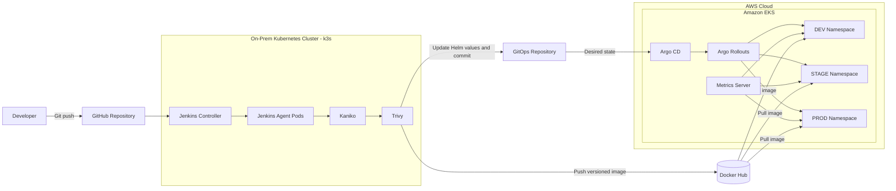
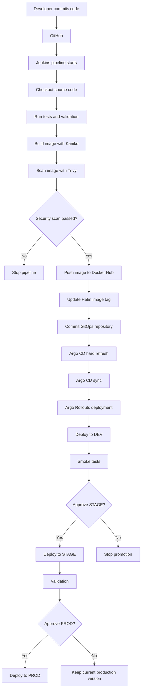
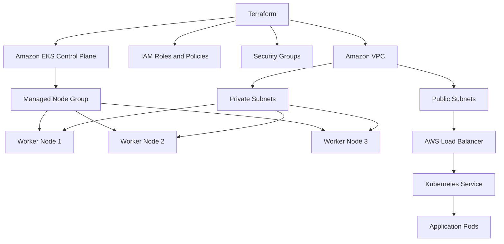
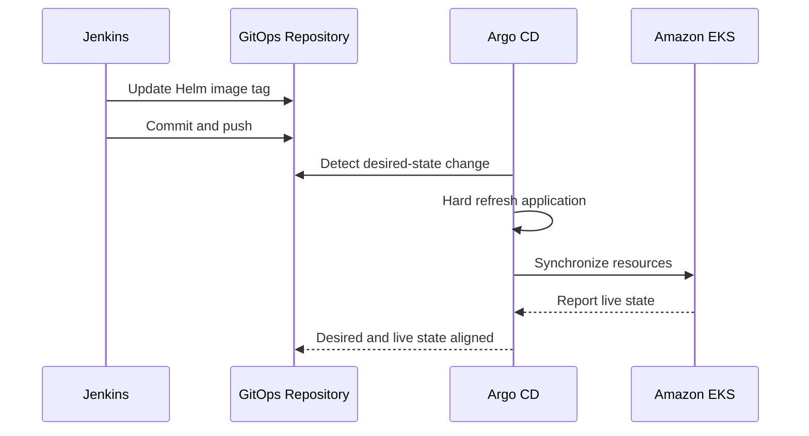
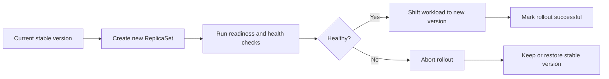
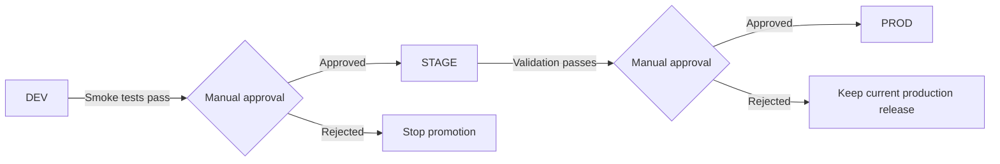
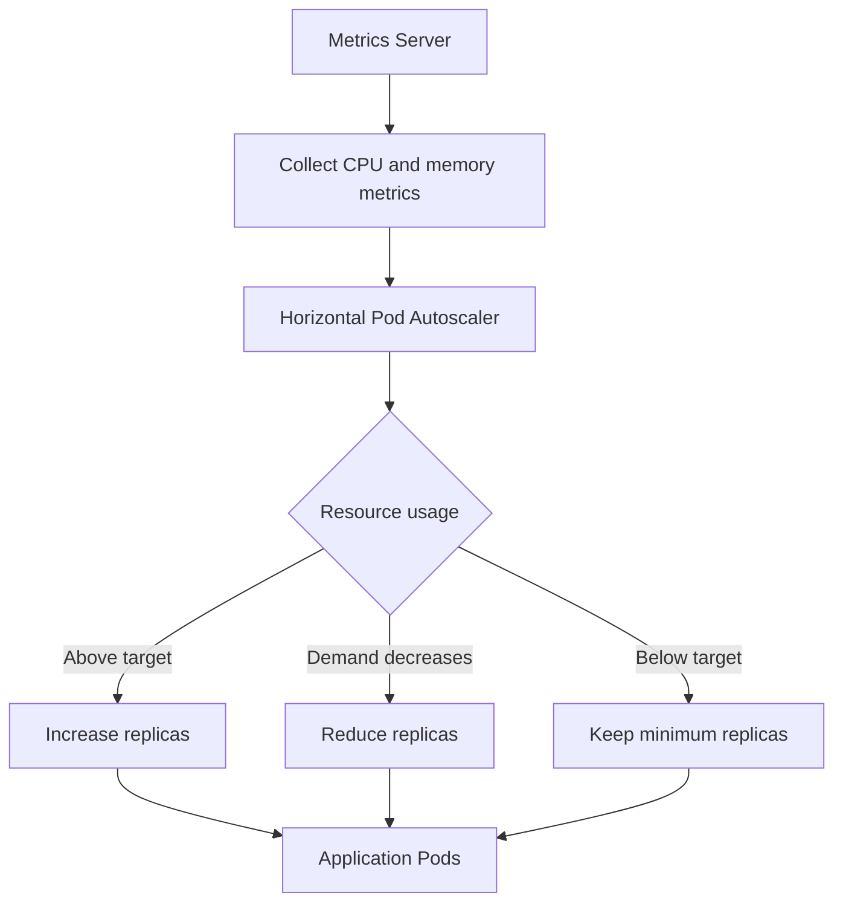
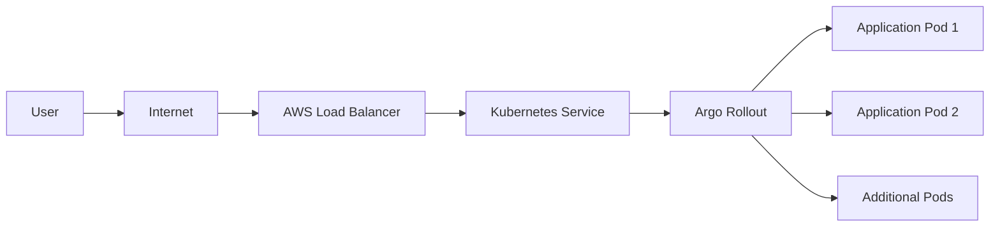

# 🚀 Enterprise Cloud-Native CI/CD Platform

> End-to-end automated software delivery platform built with **Terraform**, **Amazon EKS**, **Kubernetes**, **Jenkins**, **GitOps**, **Helm**, and **Argo Rollouts**.

<p align="center">


</p>

---

## 📖 Overview

This project demonstrates a **production-style cloud-native CI/CD platform** built around a hybrid Kubernetes architecture.

The platform automates the complete software delivery lifecycle:

- Provisioning AWS infrastructure with Terraform
- Building container images in Kubernetes with Kaniko
- Scanning images with Trivy
- Publishing images to ECR
- Updating Helm configuration
- Synchronizing Amazon EKS through Argo CD
- Deploying progressively with Argo Rollouts
- Promoting releases through DEV, STAGE, and PROD

The application is intentionally lightweight so the project can focus on the surrounding DevOps platform and deployment automation.

---

## ✨ Features

- ☁ Infrastructure as Code with Terraform
- ☸ Hybrid Kubernetes architecture using k3s and Amazon EKS
- 🚀 Jenkins CI pipeline with Kubernetes-based agents
- 📦 Daemonless container builds with Kaniko
- 🔒 Vulnerability scanning with Trivy
- 🐳 Docker Hub image registry
- 📋 Helm-based Kubernetes configuration
- 🌿 GitOps delivery with Argo CD
- 🚦 Progressive delivery with Argo Rollouts
- 📈 Horizontal Pod Autoscaling
- 🌍 Isolated DEV, STAGE, and PROD environments

---

## 🏗 Hybrid Architecture



The on-premises k3s cluster is responsible for **Continuous Integration**, while Amazon EKS is responsible for **GitOps-based application delivery and runtime workloads**.

---

## 🔄 CI/CD Workflow



Jenkins does not directly manage the final Kubernetes deployment. It updates the desired state in Git, and Argo CD reconciles Amazon EKS with that state.

---

## ☁ Terraform and AWS Infrastructure



Terraform is used to create and maintain the AWS infrastructure declaratively, including networking, IAM, security rules, the EKS cluster, and worker nodes.

---

## 🌿 GitOps Workflow



Git acts as the **single source of truth**. Manual cluster changes are discouraged because Argo CD continuously compares the live state with the declared configuration.

---

## 🚦 Progressive Delivery



Argo Rollouts provides controlled releases and safer rollback behavior compared with immediate replacement of all application Pods.

---

## 🌍 Environment Promotion



Each environment is isolated in its own Kubernetes namespace, reducing the chance that a development or staging deployment affects production.

---

## 📈 Autoscaling



The Horizontal Pod Autoscaler adjusts the number of application Pods based on current resource usage.

---

## 🌐 Request Flow



The Load Balancer exposes the application externally and distributes requests through the Kubernetes Service to healthy Pods.

---

## 🛠 Technology Stack

| Category | Technology |
|---|---|
| Cloud Provider | AWS |
| Infrastructure as Code | Terraform |
| Production Kubernetes | Amazon EKS |
| CI Kubernetes | k3s |
| Continuous Integration | Jenkins |
| Container Build | Kaniko |
| Vulnerability Scanning | Trivy |
| Container Registry | Docker Hub |
| Kubernetes Packaging | Helm |
| GitOps | Argo CD |
| Progressive Delivery | Argo Rollouts |
| Autoscaling | Horizontal Pod Autoscaler |
| Application | Python Flask |

---

## 📂 Repository Structure

```text
.
├── app/
│   ├── app.py
│   ├── requirements.txt
│   └── Dockerfile
│
├── terraform/
│   ├── main.tf
│   ├── variables.tf
│   ├── outputs.tf
│   └── terraform.tfvars
│
├── helm/
│   └── flask-app/
│       ├── Chart.yaml
│       ├── values.yaml
│       └── templates/
│
├── kubernetes/
│
├── Jenkinsfile
│
├── docs/
│   ├── FULL_DOCUMENTATION.md
│   ├── ARCHITECTURE.md
│   ├── PIPELINE.md
│   ├── TROUBLESHOOTING.md
│   └── screenshots/
│
└── README.md
```

---

## 🚀 Deployment Summary

1. Terraform provisions the AWS infrastructure and Amazon EKS cluster.
2. Jenkins receives or detects a source-code change.
3. A Kubernetes-based Jenkins agent executes the pipeline.
4. Kaniko builds a uniquely tagged container image.
5. Trivy scans the image for known vulnerabilities.
6. The image is pushed to Docker Hub.
7. Jenkins updates the Helm image tag in Git.
8. Argo CD refreshes and synchronizes the application.
9. Argo Rollouts deploys the new version.
10. The release is promoted through DEV, STAGE, and PROD.

---

## 📸 Screenshots

Add screenshots from the live environment under `docs/screenshots/`.

| Component | Suggested file |
|---|---|
| Terraform Apply | `docs/screenshots/terraform-apply.png` |
| Amazon EKS | `docs/screenshots/eks-cluster.png` |
| Jenkins Pipeline | `docs/screenshots/jenkins-pipeline.png` |
| Docker Hub | `docs/screenshots/docker-hub.png` |
| Argo CD | `docs/screenshots/argocd.png` |
| Argo Rollouts | `docs/screenshots/argo-rollouts.png` |
| Kubernetes Pods | `docs/screenshots/pods.png` |
| HPA | `docs/screenshots/hpa.png` |
| Running Application | `docs/screenshots/application.png` |

---

## 📚 Documentation

Detailed implementation, architecture, troubleshooting, security, and deployment explanations are available in:

- **[Full Project Documentation](docs/FULL_DOCUMENTATION.md)**
- **[Architecture Guide](docs/ARCHITECTURE.md)**
- **[CI/CD Pipeline Guide](docs/PIPELINE.md)**
- **[Troubleshooting Guide](docs/TROUBLESHOOTING.md)**

---

## 🎯 Learning Outcomes

This project demonstrates practical experience with:

- Infrastructure as Code
- AWS networking and Amazon EKS
- Kubernetes administration
- CI/CD pipeline development
- Kubernetes-native image building
- Container vulnerability scanning
- Helm packaging
- GitOps reconciliation
- Progressive delivery
- Multi-environment promotion
- Kubernetes networking and autoscaling
- Real-world troubleshooting

---

## 👨‍💻 Author

**Eshed Porat**

Cloud · DevOps · Kubernetes · AWS · Automation
