🚀 Enterprise Cloud-Native CI/CD Platform

A production-style cloud-native CI/CD platform demonstrating Infrastructure as Code, Kubernetes, GitOps, Progressive Delivery, and automated deployments on AWS.

📖 Overview

This project demonstrates the implementation of a production-ready CI/CD platform using a hybrid Kubernetes architecture.

The CI pipeline executes on an on-premises k3s cluster, while application workloads are deployed to Amazon EKS.

The platform automates the complete software delivery lifecycle—from infrastructure provisioning with Terraform to progressive application deployments using GitOps.

✨ Key Features
Infrastructure as Code with Terraform
Amazon EKS Kubernetes Cluster
Amazon ECR Container Registry
Jenkins CI Pipeline
Kubernetes-based Jenkins Agents
Kaniko Container Builds
Trivy Vulnerability Scanning
Helm Deployments
GitOps with Argo CD
Progressive Delivery with Argo Rollouts
Horizontal Pod Autoscaler
DEV / STAGE / PROD Environments
🔄 CI/CD Pipeline

<<<<<<< HEAD
The following diagram illustrates the complete deployment workflow from source code to production.
=======
- Provisioning AWS infrastructure with Terraform
- Building container images in Kubernetes with Kaniko
- Scanning images with Trivy
- Publishing images to ECR
- Updating Helm configuration
- Synchronizing Amazon EKS through Argo CD
- Deploying progressively with Argo Rollouts
- Promoting releases through DEV, STAGE, and PROD

The application is intentionally lightweight so the project can focus on the surrounding DevOps platform and deployment automation.

---

## ✨ Features

- ☁ Infrastructure as Code with Terraform
- ☸ Hybrid Kubernetes architecture using k3s and Amazon EKS
- 🚀 Jenkins CI pipeline with Kubernetes-based agents
- 📦 Daemonless container builds with Kaniko
- 🔒 Vulnerability scanning with Trivy
- 🐳 Docker Hub image registry
- 📋 Helm-based Kubernetes configuration
- 🌿 GitOps delivery with Argo CD
- 🚦 Progressive delivery with Argo Rollouts
- 📈 Horizontal Pod Autoscaling
- 🌍 Isolated DEV, STAGE, and PROD environments

---

## 🏗 Hybrid Architecture
>>>>>>> 915c70093e76b74552a1d419a60984765937ea21

```mermaid
flowchart LR

A["👨‍💻 Developer"] -->|"1. Git Push"| B["GitHub Repository"]

B -->|"2. Trigger Pipeline"| C["Jenkins"]

C -->|"3. Checkout Source"| D["Kubernetes Jenkins Agent"]

D -->|"4. Build Image"| E["Kaniko"]

E -->|"5. Security Scan"| F["Trivy"]

F -->|"6. Push Image"| G["Amazon ECR"]

G -->|"7. Update Image Tag"| H["Helm Values"]

H -->|"8. Commit"| I["GitOps Repository"]

I -->|"9. Detect Changes"| J["Argo CD"]

J -->|"10. Synchronize"| K["Amazon EKS"]

K -->|"11. Progressive Deployment"| L["Argo Rollouts"]

L -->|"12. Deploy"| M["DEV"]

M -->|"Validation"| N{"Promote?"}

N -->|"Yes"| O["STAGE"]

O -->|"Validation"| P{"Promote?"}

P -->|"Yes"| Q["PROD"]

N -->|"No"| R["Stop Promotion"]

P -->|"No"| R
```

📖 Pipeline Overview
1. Developer Commit

A developer pushes new code to the GitHub repository.

2. Jenkins Pipeline

Jenkins automatically detects the new commit and starts the CI pipeline using a Kubernetes-based Jenkins Agent running inside the on-premises k3s cluster.

3. Container Build

Kaniko builds the application container image without requiring a Docker daemon.

4. Security Scan

Trivy scans the newly built image for operating system and application vulnerabilities. The pipeline stops if critical vulnerabilities are detected.

5. Amazon ECR

After passing the security scan, the image is pushed to Amazon Elastic Container Registry (ECR).

6. Helm Update

Jenkins updates the Helm chart with the newly generated image tag.

7. GitOps Repository

The updated Helm configuration is committed to the GitOps repository, which serves as the single source of truth.

8. Argo CD

Argo CD continuously monitors the GitOps repository and synchronizes Amazon EKS whenever a change is detected.

9. Progressive Deployment

Argo Rollouts performs a controlled deployment of the new version instead of replacing every Pod simultaneously.

10. Environment Promotion

The application is deployed to the DEV environment. After validation, it can be promoted to STAGE and finally to PROD.

🛠 Technology Stack
Layer	Technology
Cloud	AWS
Infrastructure	Terraform
Kubernetes	Amazon EKS & k3s
Continuous Integration	Jenkins
Build Engine	Kaniko
Security	Trivy
Container Registry	Amazon ECR
GitOps	Argo CD
Progressive Delivery	Argo Rollouts
Package Management	Helm
Application	Python Flask
📂 Repository Structure
.
├── app/
├── terraform/
├── helm/
├── kubernetes/
├── Jenkinsfile
├── docs/
│   └── FULL_DOCUMENTATION.md
└── README.md
📸 Screenshots

Include screenshots of:

Terraform Apply
Amazon EKS
Amazon ECR Repository
Jenkins Pipeline
Argo CD Dashboard
Argo Rollouts
Kubernetes Pods
Running Application
📚 Documentation

The complete project implementation, architecture, deployment details, troubleshooting, and design decisions are documented in:

📖 docs/FULL_DOCUMENTATION.md